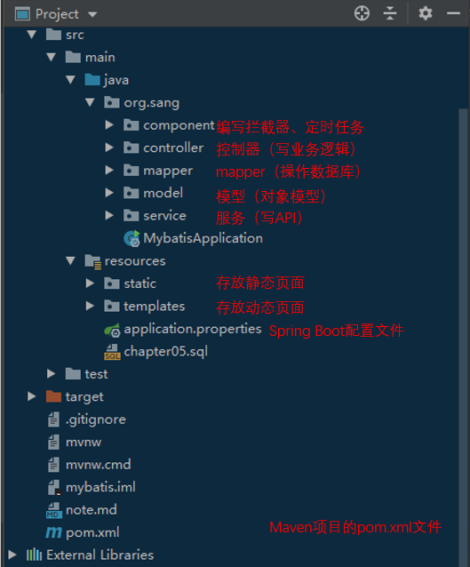
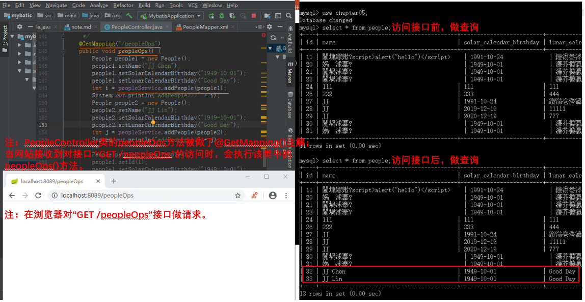
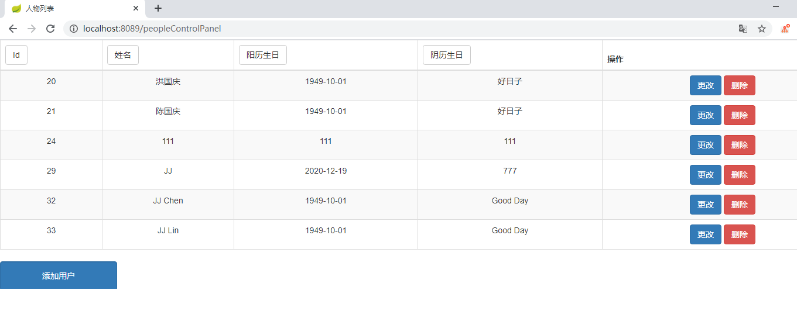

### Spring Boot开发初体验

#### 0x00前言

SpringBoot是轻量级的Java开发框架，在继承Spring框架原有优秀特性的同时，通过简化配置来进一步简化了Spring应用的搭建和开发过程。

小编在近期学习了一点Spring Boot开发，同时编写了小应用“birthday card”，并决定通过这篇博客将近阶段的学习笔记记录下来。

这份源码的下载地址如下：[birthday card](https://github.com/chenergy1991/DetectionScript)

小应用的功能和页面都很粗糙，主要为以下几点：

1. 通过网页对人物生日信息的增删改查
2. 简易的管理员登录功能（未登录则不能访问页面）
3. 生日提醒功能

在这一版本的代码中，小编暂未对一些漏洞进行防御，将在后面的博客对这些漏洞进行修复和介绍。

#### 0x01项目结构概览

小应用的工程结构如图所示。



注：包的名字有controller、service、mapper等等，这和如下的Java的业务逻辑处理顺序（或者说是典型分层方式）有着一定的关联：
```
Controller-->service接口-->serviceImpl-->dao接口-->daoImpl-->mapper-->db
```

小应用的技术选型情况如下：

* 数据库：MySQL 5.0.96
* Spring Boot整合持久层技术：Mybatis
* Spring Boot整合视图层技术：Thymeleaf
* 前端组件库：bootstrap
* JDK：9.0.4

#### 0x02代码解析

这个工程基于《Spring Boot + Vue全栈开发实战》第5章的例程进行二次开发。接下来依次对工程的3个功能点做代码解析。

##### 2.1 通过网页对人物生日信息的增删改查

这部分代码涉及到了Spring Boot整合的持久层技术“MyBatis”以及视图层技术“Thymeleaf”。先来看Mybatis方面。

######（1）创建项目

创建Spring Boot项目，在pom.xml文件中添加MyBatis依赖、数据库驱动依赖以及数据库连接池依赖，代码如下：

```
		<dependency>
			<groupId>org.springframework.boot</groupId>
			<artifactId>spring-boot-starter-web</artifactId>
		</dependency>

		<dependency>
			<groupId>org.mybatis.spring.boot</groupId>
			<artifactId>mybatis-spring-boot-starter</artifactId>
			<version>1.3.2</version>
		</dependency>

		<dependency>
			<groupId>org.springframework.boot</groupId>
			<artifactId>spring-boot-starter-test</artifactId>
			<scope>test</scope>
		</dependency>

		<dependency>
			<groupId>com.alibaba</groupId>
			<artifactId>druid</artifactId>
			<version>1.1.9</version>
		</dependency>

		<dependency>
			<groupId>mysql</groupId>
			<artifactId>mysql-connector-java</artifactId>
			<scope>runtime</scope>
		</dependency>
```
######（2）创建数据库、表、实体类

在数据库中创建表，参考SQL脚本如下：

```
CREATE DATABASE `chapter05` DEFAULT CHARACTER SET utf8;
USE `chapter05`;
CREATE TABLE `people`(
    `id` int(11) NOT NULL AUTO_INCREMENT,
    `name` varchar(128) DEFAULT NULL,
    `solar_calendar_birthday` varchar(64)  DEFAULT NULL,
    `lunar_calendar_birthday` varchar(64)  DEFAULT NULL,
    PRIMARY KEY(`id`)
) ENGINE=InnoDB DEFAULT CHARSET=utf8;
insert into `people`(`id`,`name`,`solar_calendar_birthday`,`lunar_calendar_birthday`)values (1,'陈某某','1991-10-24','九月十七'),(2,'李某某','1966-12-08','十二月十七');

```
创建chapter05数据库，在数据空中创建people表，同时插入两条测试数据。

实体类People的代码如下：

```
package org.sang.model;

/**
 * Created by sang on 2018/7/15.
 */
public class People {

    /**
     * id
     */
    private Integer id;

    /**
     * 姓名
     */
    private String name;

    /**
     * 阳历生日
     */
    private String solarCalendarBirthday;

    /**
     * 阴历生日
     */
    private String lunarCalendarBirthday;

    public Integer getId() {
        return id;
    }

    public void setId(Integer id) {
        this.id = id;
    }

    public String getName() {
        return name;
    }

    public void setName(String name) {
        this.name = name;
    }

    public String getSolarCalendarBirthday() {
        return solarCalendarBirthday;
    }

    public void setSolarCalendarBirthday(String solarCalendarBirthday) {
        this.solarCalendarBirthday = solarCalendarBirthday;
    }

    public String getLunarCalendarBirthday() {
        return lunarCalendarBirthday;
    }

    public void setLunarCalendarBirthday(String lunarCalendarBirthday) {
        this.lunarCalendarBirthday = lunarCalendarBirthday;
    }

    @Override
    public String toString() {
        return "People{" +
                "id=" + id +
                ", name='" + name + '\'' +
                ", solarCalendarBirthday='" + solarCalendarBirthday + '\'' +
                ", lunarCalendarBirthday='" + lunarCalendarBirthday + '\'' +
                '}';
    }

    public People(Integer id,String name, String solarCalenderBirthday, String lunarCalenderBirthday) {
        this.id = id;
        this.name = name;
        this.solarCalendarBirthday = solarCalenderBirthday;
        this.lunarCalendarBirthday = lunarCalenderBirthday;
    }

    public People() {
    }
}

```


######（3）数据库配置

在application.properties中配置数据库基本连接信息：

```
#######数据库配置
spring.datasource.type=com.alibaba.druid.pool.DruidDataSource
spring.datasource.url=jdbc:mysql:///chapter05?allowMultiQueries=true
spring.datasource.username=root
spring.datasource.password=root
```

######（4）创建数据库访问层

创建PeopleMapper类，代码如下：

```
package org.sang.mapper;

import org.apache.ibatis.annotations.Mapper;
import org.apache.ibatis.annotations.Param;
import org.sang.model.People;

import java.util.List;

/**
 *People Mapper接口
 * @author Jake J.Chen
 * @date 2019/11/10
 */
@Mapper
public interface PeopleMapper {

    /**
     *增加人物对象
     *
     * @param people 人物对象
     * @return int
     */
    int addPeople(People people);

    /**
     *通过ID删除人物信息
     *
     * @param id 人物ID
     * @return int
     */
    int deletePeopleById(Integer id);

    /**
     *更新人物对象
     *
     * @param people 人物对象
     * @return int
     */
    int updatePeopleById(People people);

    /**
     *通过ID获得人物对象
     *
     * @param id 人物ID
     * @return List <People>
     */
    People getPeopleById(Integer id);

    /**
     *获得所有人物的列表
     *
     * @return List <People>
     */
    List<People> getAllPeople();

    /**
     *通过关键字获得人物列表
     *
     * @param keyword 搜索关键字
     * @return List <People>
     */
    List <People> getAllPeopleByKeyword(String keyword);

    /**
     *获得所有人物的列表，同时按照关键字排序
     *
     * @param keyword 排序关键字
     * @return List <People>
     */
    List <People> getAllPeopleAndOrderByKeyword(@Param("keyword") String keyword);

    /**
     *通过生日获得人物列表
     *
     * @param birthday 搜索关键字
     * @return List <People>
     */
    List <People> getAllPeopleByBirthday(String birthday);
}

```
代码解释：

* 在项目的根包下面创建一个子包mapper，在该子包中创建PeopleMapper。
* 在PeopleMapper上添加@Mapper注解，表明该接口是MyBatis中的Mapper。

######（5）创建PeopleMapper.xml

在与PeopleMapper相同的位置创建PeopleMapper.xml文件，代码如下：

```
<?xml version="1.0" encoding="UTF-8" ?>
<!DOCTYPE mapper
        PUBLIC "-//mybatis.org//DTD Mapper 3.0//EN"
        "http://mybatis.org/dtd/mybatis-3-mapper.dtd">
<mapper namespace="org.sang.mapper.PeopleMapper">

    <resultMap id="BaseResultMap" type="org.sang.model.People">
        <id column="id" property="id" jdbcType="INTEGER"/>
        <result column="name" property="name" jdbcType="VARCHAR"/>
        <result column="solar_calendar_birthday" property="solarCalendarBirthday" jdbcType="VARCHAR"/>
        <result column="lunar_calendar_birthday" property="lunarCalendarBirthday" jdbcType="VARCHAR"/>
    </resultMap>

    <!--增加人物信息-->
    <insert id="addPeople"  parameterType="org.sang.model.People">
        INSERT INTO people(name,solar_calendar_birthday,lunar_calendar_birthday) VALUES (#{name},#{solarCalendarBirthday},#{lunarCalendarBirthday})
    </insert>

    <!--通过Id删除人物信息-->
    <delete id="deletePeopleById" parameterType="int">
        DELETE FROM people WHERE id=#{id}
    </delete>

    <!--通过Id更新人物信息-->
    <update id="updatePeopleById" parameterType="org.sang.model.People" >
        UPDATE people set name=#{name},solar_calendar_birthday=#{solarCalendarBirthday}, lunar_calendar_birthday=#{lunarCalendarBirthday} WHERE id=#{id}
    </update>

    <!--通过Id获得人物信息-->
    <select id="getPeopleById" parameterType="int" resultMap="BaseResultMap">
        SELECT * FROM people WHERE id=#{id}
    </select>

    <!--获得人物列表-->
    <select id="getAllPeople" resultMap="BaseResultMap">
            SELECT * FROM people
    </select>

    <!--通过关键字获得人物列表-->
    <select id="getAllPeopleByKeyword" parameterType="string" resultMap="BaseResultMap">
            SELECT * FROM people
            where name like concat('%', #{keyword}, '%')
            ORDER BY id ASC
    </select>

    <!--获得所有人物的列表，同时按照关键字排序-->
    <select id="getAllPeopleAndOrderByKeyword" parameterType="string" resultMap="BaseResultMap">
            SELECT * FROM people

            ORDER BY ${keyword} DESC
    </select>

    <!--通过生日获得人物列表-->
    <select id="getAllPeopleByBirthday" parameterType="string" resultMap="BaseResultMap">
            SELECT * FROM people
            where solar_calendar_birthday like concat('%', #{keyword}, '%')
    </select>
</mapper>

```
代码解释：
* 针对PeopleMapper接口中的每一个方法，都在PeopleMapper.xml中列出实现。
* “#{}”用来代替接口中的参数，实体类中的属性可以直接通过“#{实体类属性名}”获取。

######（6）创建Service和Controller

该Service类的代码如下：

```
package org.sang.service;

import org.sang.mapper.PeopleMapper;
import org.sang.model.People;
import org.springframework.beans.factory.annotation.Autowired;
import org.springframework.stereotype.Service;

import java.util.List;

/**
 *People Service
 * @author Jake J.Chen
 * @date 2019/11/10
 */
@Service
public class PeopleService {
    @Autowired
    PeopleMapper peopleMapper;
    /**
     *增加人物对象
     *
     * @param people 人物对象
     * @return int
     */
    public int addPeople(People people) {
        return peopleMapper.addPeople(people);
    }

    /**
     *通过ID删除人物信息
     *
     * @param id 人物ID
     * @return int
     */
    public int deletePeopleById(Integer id) {
        return peopleMapper.deletePeopleById(id);
    }

    /**
     *更新人物对象
     *
     * @param people 人物对象
     * @return int
     */
    public int updatePeople(People people) {
        return peopleMapper.updatePeopleById(people);
    }

    /**
     *通过ID获得人物对象
     *
     * @param id 人物ID
     * @return List <People>
     */
    public People getPeopleById(Integer id) {
        return peopleMapper.getPeopleById(id);
    }

    /**
     *获得所有人物的列表
     *
     * @return List <People>
     */
    public List<People> getAllPeople() {
        return peopleMapper.getAllPeople();
    }

    /**
     *通过关键字获得人物列表
     *
     * @param keyword 搜索关键字
     * @return List <People>
     */
    public List<People> getAllPeopleByKeyword(String keyword) {
        return peopleMapper.getAllPeopleByKeyword(keyword);
    }

    /**
     *通过关键字获得人物列表
     *
     * @param keyword 搜索关键字
     * @return List <People>
     */
    public List<People> getAllPeopleAndOrderByKeyword(String keyword) {
        return peopleMapper.getAllPeopleAndOrderByKeyword(keyword);
    }

    /**
     *通过生日获得人物列表
     *
     * @param birthday 搜索关键字
     * @return List <People>
     */
    public List<People> getAllPeopleByBirthday(String keyword) {
        return peopleMapper.getAllPeopleByBirthday(keyword);
    }
}

```

该Controller类的代码如下：

```
package org.sang.controller;

import org.sang.model.People;
import org.sang.service.PeopleService;
import org.springframework.beans.factory.annotation.Autowired;
import org.springframework.ui.Model;
import org.springframework.web.bind.annotation.GetMapping;
import org.springframework.web.bind.annotation.PathVariable;
import org.springframework.web.bind.annotation.PostMapping;
import org.springframework.web.bind.annotation.RestController;
import org.springframework.web.servlet.ModelAndView;

import javax.servlet.http.HttpServletRequest;
import java.util.List;

/**
 *People Mapper接口
 * @author Jake J.Chen
 * @date 2019/11/10
 */
@RestController
public class PeopleController {
    @Autowired
    PeopleService peopleService;

    /**
     *功能描述：增加 人物信息 测试方法（方法的返回值是void）
     * @author Chenergy
     * @date 2019/11/10
     * @param
     * @return
     */
    @GetMapping("/peopleOps")
        People people1 = new People();
            people1.setName("JJ Chen");
            people1.setSolarCalendarBirthday("1949-10-01");
            people1.setLunarCalendarBirthday("Good Day");
            int i = peopleService.addPeople(people1);
            System.out.println("addPeople>>>" + i);
            People people2 = new People();
            people2.setName("JJ Lin");
            people2.setSolarCalendarBirthday("1949-10-01");
            people2.setLunarCalendarBirthday("Good Day");
            int j = peopleService.addPeople(people2);
            System.out.println("addPeople>>>" + j);
    }
}

```
######（7）配置pom.xml文件

在Maven工程中，XML配置文件建议写在resources目录下，但是上文的Mapper.xml文件写在包下，Maven在运行时会忽略包下的XML文件，因此需要在pom.xml文件中重新指明资源文件位置，配置如下。

```
	<build>
		<resources>
			<resource>
				<directory>src/main/java</directory>
				<includes>
					<include>**/*.xml</include>
				</includes>
			</resource>
			<resource>
				<directory>src/main/resources</directory>
			</resource>
		</resources>
		<plugins>
			<plugin>
				<groupId>org.springframework.boot</groupId>
				<artifactId>spring-boot-maven-plugin</artifactId>
			</plugin>
		</plugins>
	</build>

```

######（8）接口测试

在浏览器访问“http://localhost:8089/peopleOps”，即可看到数据库中数据的变化，如图所示。



注：上面是对持久层技术“MyBatis”的使用简介，接下来进行整合视图层技术“Thymeleaf”的简介。

######（9）添加Thymeleaf依赖

在pom.xml文件中添加依赖，代码如下：

```
		<dependency>
			<groupId>org.springframework.boot</groupId>
			<artifactId>spring-boot-starter-thymeleaf</artifactId>
		</dependency>
```

######（10）配置Thymeleaf

若想要对默认的Thyemeleaf参数进行自定义配置，那么可以直接在application.properties中进行配置，部分常见配置如下：

```
######整合Thymeleaf
#是否开启缓存，开发时可设置为false，默认为true
spring.thymeleaf.cache=true
#检查模板是否存在，默认为true
spring.thymeleaf.check-template=true
##检查模板位置是否存在，默认为true
spring.thymeleaf.check-template-location=true
#模板文件编码
spring.thymeleaf.encoding=UTF-8
#模板文件位置
spring.thymeleaf.prefix=classpath:/templates/
#Content-Type配置
spring.thymeleaf.servlet.content-type=text/html
#模板文件后缀
spring.thymeleaf.suffix=.html
```

######（11）配置控制器

由于已经创建People实体类，可在Controller中设置返回ModelAndView。

Controller类的代码如下（为了便于讲解，已经省略了部分代码）：

```
package org.sang.controller;

import org.sang.model.People;
import org.sang.service.PeopleService;
import org.springframework.beans.factory.annotation.Autowired;
import org.springframework.ui.Model;
import org.springframework.web.bind.annotation.GetMapping;
import org.springframework.web.bind.annotation.PathVariable;
import org.springframework.web.bind.annotation.PostMapping;
import org.springframework.web.bind.annotation.RestController;
import org.springframework.web.servlet.ModelAndView;

import javax.servlet.http.HttpServletRequest;
import java.util.List;

/**
 *People Mapper接口
 * @author Jake J.Chen
 * @date 2019/11/10
 */
@RestController
public class PeopleController {
    @Autowired
    PeopleService peopleService;
    /**
     * 获取"人物信息控制面板"表单页面
     * @return ModelAndView
     */
    @GetMapping("/peopleControlPanel")
    public ModelAndView peopleList(){
        List<People> allPeople = peopleService.getAllPeople();
        ModelAndView mv = new ModelAndView();
        mv.addObject("people", allPeople);
        mv.setViewName("peopleControlPanel");
        return mv;
    }
    /*已经省略掉部分代码*/
    /**
     *功能描述：增加 人物信息 测试方法（方法的返回值是void）
     * @author Chenergy
     * @date 2019/11/10
     * @param
     * @return
     */
    @GetMapping("/peopleOps")
    public void peopleOps() {
        People people1 = new People();
        people1.setName("JJ Chen");
        people1.setSolarCalendarBirthday("1949-10-01");
        people1.setLunarCalendarBirthday("Good Day");
        int i = peopleService.addPeople(people1);
        System.out.println("addPeople>>>" + i);
        People people2 = new People();
        people2.setName("JJ Lin");
        people2.setSolarCalendarBirthday("1949-10-01");
        people2.setLunarCalendarBirthday("Good Day");
        int j = peopleService.addPeople(people2);
        System.out.println("addPeople>>>" + j);

    }

}

```
在PeopleController类中，会返回ModelAndView,设置视图名为peopleControlPanel，返回数据为所创建的List集合。

######（12）创建视图

在resources目录下的templates目录中创建peopleControlPanel.html，具体代码如下：

```
<!DOCTYPE html>
<html lang="en" xmlns:th="http://www.thymeleaf.org">
<head>
    <meta charset="UTF-8">
    <title>人物列表</title>
    <link href="/css/bootstrap.css" rel="stylesheet">
</head>

<style>
    a{
        color:#fff;
    }
</style>

<body>
    <table class="table table-striped table-bordered table-hover text-center">
        <thead>
        <tr style="text-align:center">
            <th><a class='btn btn-default' href="/searchAndOrderBy?k=id">Id</a></th>
            <th><a class='btn btn-default' href="/searchAndOrderBy?k=name">姓名</a></th>
            <th><a class='btn btn-default' href="/searchAndOrderBy?k=solar_calendar_birthday">阳历生日</a></th>
            <th><a class='btn btn-default' href="/searchAndOrderBy?k=lunar_calendar_birthday">阴历生日</a></th>
            <th>操作</th>
        </tr>
    </thead>
    <tbody>
        <tr th:each="p:${people}">
            <td th:text="${p.id}"></td>
            <td th:text="${p.name}"></td>
            <td th:text="${p.solarCalendarBirthday}"></td>
            <td th:text="${p.lunarCalendarBirthday}"></td>
            <td>
                <a class="btn btn-primary" th:href="@{'/update/'+${p.id}}">更改</a>
                <a class="btn btn-danger" th:href="@{'/delete/'+${p.id}}">删除</a>
            </td>
        </tr>
    </tbody>
    </table>
    <div style="width:200px;height:100%;">
        <button class="btn btn-primary form-control" style="height:50px"><a th:href="@{'/peopleAddForm'}">添加用户</a></button>
    </div>
</body>
</html>

```
代码解释：

* 首先在第2行导入Thymeleaf命名空间。
* 模板引擎会通过遍历将people中的数据展示出来，Thymeleaf中通过th:each进行集合遍历，通过th:text展示数据。

######（13）运行
在浏览器地址栏输入“http://localhost:8089/peopleControlPanel”即可看到运行结果。



注： 在这个小应用中，通过网页对人物生日信息的增删改查处理是较为相似的（均包含了“配置控制器”和“创建视图”），这里仅对“查”进行了简介，不对“增删改”做介绍了。前端的界面很粗糙，这里也不做介绍了。感兴趣的小伙伴可以自行阅读这部分的代码；

##### 2.2 简易的管理员登录功能（未登录则不能访问页面）

为了给系统增加管理员登录功能，使未登录的用户不能访问页面，可以考虑使用Spring Boot中的拦截器。创建拦截器实现LoginInterceptor接口，代码如下：

```
package org.sang.component;

import org.springframework.lang.Nullable;
import org.springframework.stereotype.Component;
import org.springframework.web.servlet.HandlerInterceptor;
import org.springframework.web.servlet.ModelAndView;

import javax.servlet.http.HttpServletRequest;
import javax.servlet.http.HttpServletResponse;
import javax.servlet.http.HttpSession;

@Component
public class LoginInterceptor implements HandlerInterceptor {
    @Override
    /**
     *功能描述：这个方法是在访问接口之前执行的，我们只需要在这里写验证登陆状态的业务逻辑，就可以在用户调用指定接口之前验证登陆状态了。
     * @author Chenergy
     * @date 2019/12/29
     * @param
     * @return
     */
    public boolean preHandle(HttpServletRequest request, HttpServletResponse response, Object handler) throws Exception {
        //每一个项目的登录实现逻辑都有所区别，这里使用最简单的Session提取loginUser来验证登陆。
        HttpSession session = request.getSession();
        //这里的loginUser是登录时放入Session的
        Object admin = (Object)session.getAttribute("loginUser");
        //如果session中没有admin，表示没登陆
        if (admin == null){
            //这个方法返回false表示忽略当前请求（如果一个用户调用了“需要登录才能使用的接口”，若该用户尚未登录，则该请求会被忽略掉）
            //也可以利用response给用户返回一些提示信息，告诉他尚未登录
            return false;
        }else {
            //如果session里有admin，表示该用户已经登陆，放行，用户即可继续调用自己需要的接口
            return true;
        }
    }

    @Override
    public void postHandle(HttpServletRequest request, HttpServletResponse response, Object handler, @Nullable ModelAndView modelAndView) throws Exception {
    }
    @Override
    public void afterCompletion(HttpServletRequest request, HttpServletResponse response, Object handler, @Nullable Exception ex) throws Exception {
    }
}
```
拦截器中的方法将按preHandle-->Controller-->postHandle-->afterCompletion的顺序执行。注意只有preHandle方法返回true时，后面的方法才会执行。
该拦截器的判断逻辑为：在访问Controller类的方法之前，会先判断HttpSession是否为空，若不为空，则返回false，否则返回true。


1. 注册拦截器


3. 生日提醒功能


是笔者在初体验Spring Boot开发后所成的开源项目。


SpringBoot+MyBatis+Thymeleaf做


### 登录验证功能
[SpringBoot + thymeleaf 实现简单的登陆验证](https://www.jianshu.com/p/442dd9de4e90)


调试问题记录
Mybatis查询语句返回的对象中部分字段为null(空)
https://blog.csdn.net/m0_37961948/article/details/85344944

SpringBoot+MyBatis+thymeleaf 增删改查实例（超详细）
https://blog.csdn.net/Woo_home/article/details/99564476

SpringBoot集成Thymeleaf模板引擎实现数据的增删改查
https://blog.csdn.net/w252064/article/details/83998724

解决mybatis的mapper.xml查询不出数据，结果一直为null问题
https://blog.csdn.net/ITBigGod/article/details/82691295

windows下如何安装配置maven
https://jingyan.baidu.com/article/3065b3b6a00792becef8a46c.html

阿里巴巴Java开发规约IDEA插件安装及使用
https://www.cnblogs.com/cnndevelop/p/7697920.html


    https://blog.csdn.net/Develop_007/article/details/88568809


我的 Input框 不可能这么可爱
https://blog.csdn.net/weixin_37615279/article/details/100516311

springboot+jwt完成登录认证
https://www.cnblogs.com/30go/p/10963924.html


Spring Boot使用JWT实现系统登录验证
https://www.cnblogs.com/xifengxiaoma/p/9508477.html

展示某文件夹的文件

SpringBoot + Spring Security 基本使用及个性化登录配置详解

https://www.jb51.net/article/140429.htm

https://blog.csdn.net/qq_30745307/article/details/80974407

SpringBoot日记——登录与拦截器篇
https://www.cnblogs.com/iceb/p/9227838.html

Spring Boot拦截器配置拦截登陆
https://blog.csdn.net/qq_30745307/article/details/80974407

springboot学习--定时任务及cron表达式
https://blog.csdn.net/baidu_41669919/article/details/79159174

可以设置每多少天的某个时间执行

<1>整合MyBatis
创建项目
创建数据库、表、实体类等
创建数据库访问层
创建PeopleMapper.xml
创建Service和Controller
配置pom.xml文件


<2>整合Thymeleaf

<3>使用“@Schedule定时任务”

##### 参考图书

* 《Spring Boot + Vue 全栈开发实战》
* 《Java EE互联网轻量级框架整合开发》（SSM框架（SpringMVC + Spring + MyBatis）和Redis实现）
