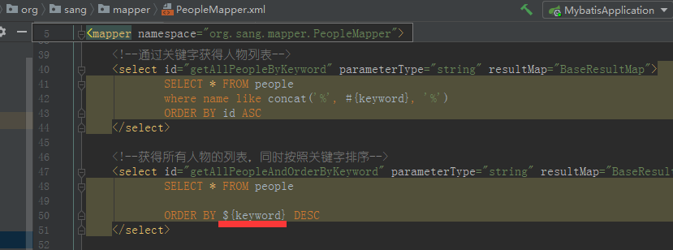
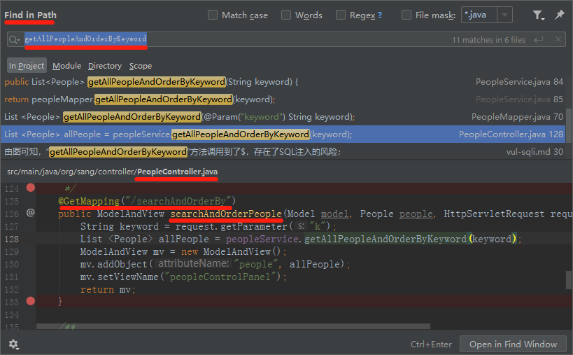
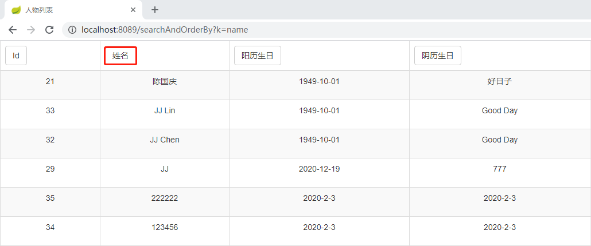
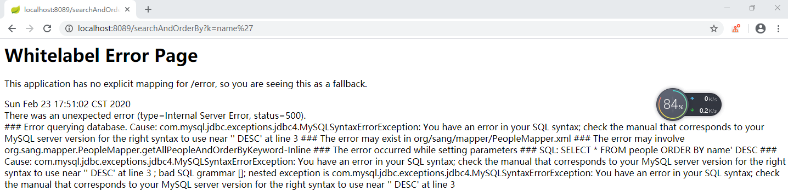
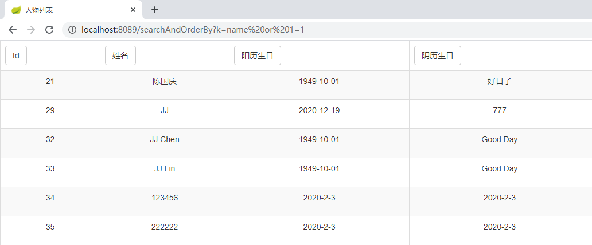
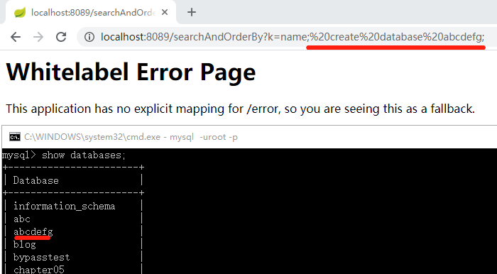

###vul-01 “持久化框架MyBatis SQL注入漏洞（order by）”的黑白盒测试与漏洞修复

##### 0x01 漏洞简介

在使用MyBatis持久化框架时，“order by”语句可能引发SQL注入漏洞；

示例如下：
```
Select * from news where title =‘java代码审计’ order by #{time} asc
```
这样写程序会报错，研发人员将SQL查询语句修改如下：

```
Select * from news where title =‘java代码审计’ order by ${time} asc
```
修改之后，程序通过但可能会造成sql注入问题。

审计策略如下：

在注解中或者MyBatis相关的配置文件中搜索 $ 。然后查看相关sql语句上下文环境。

修复方案：

手动过滤用户的输入。

##### 0x02 黑白盒测试

步骤1，在MyBatis的相关的xml配置文件搜索$



由图可知，“getAllPeopleAndOrderByKeyword”方法调用到了$，存在了SQL注入的风险；

步骤2，在这份源码中查看“getAllPeopleAndOrderByKeyword”方法的实现；



由图可知，该方法位于“PeopleController.java”文件中，接口“GET /searchAndOrderBy”会触发方法的执行；在该方法的执行过程中，方法会接收HTTP请求参数“keyword”，但不会对该方法做任何参数校验，由此可判断，此处存在SQL注入的风险。


步骤3，尝试对接口“GET /searchAndOrderBy”进行SQL注入；

测试用例1：正常访问接口

```
http://localhost:8089/searchAndOrderBy?k=name
```


测试用例2：为传入的参数加单引号

```
http://localhost:8089/searchAndOrderBy?k=name'
```



测试用例3：为传入的参数后面接永真的表达式“or 1 = 1”

```
http://localhost:8089/searchAndOrderBy?k=name%20or%201=1

```


测试用例4：为传入的参数后面接数据库的操作语句“create database abcdef”

```
http://localhost:8089/searchAndOrderBy?k=name; create database abcdefg;

```



注：已经在application.propetries配置了“allowMultiQueries=true”,该设置可能会提高系统的风险系数。


由这4个小实验可以推知，此处确实存在SQL注入漏洞。

##### 0x03 漏洞修复

强化对参数“keyword”的参数校验，比如将MyBatis的相关配置文件修改成：

```
    <!--获得所有人物的列表，同时按照关键字排序-->
    <select id="getAllPeopleAndOrderByKeyword" parameterType="string" resultMap="BaseResultMap">
            SELECT * FROM people
            <if test = "keyword == 'id' or keyword == 'name' or keyword == 'solar_calendar_birthday' or keyword == 'lunar_calendar_birthday'">
                ORDER BY ${keyword} DESC
            </if>
            <!--ORDER BY ${keyword} DESC-->
    </select>
```


